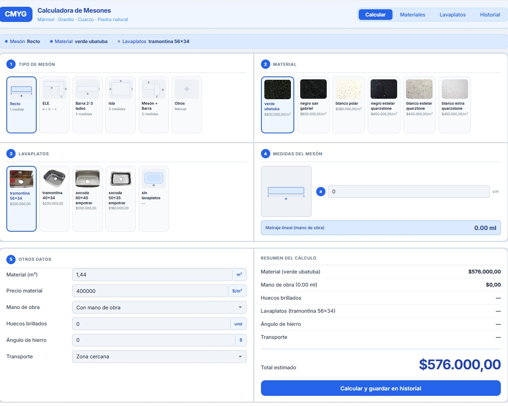
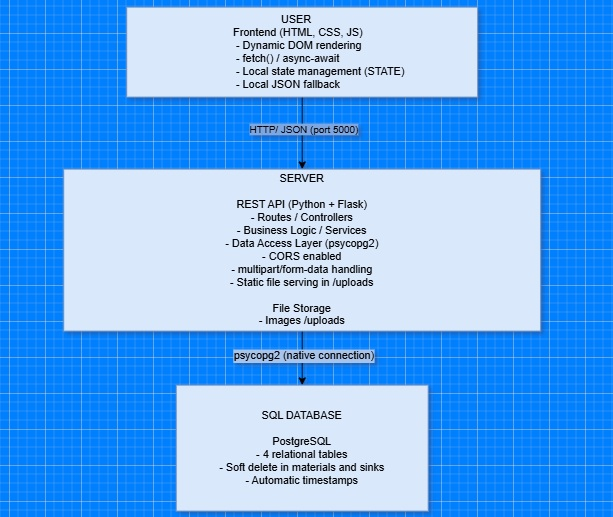
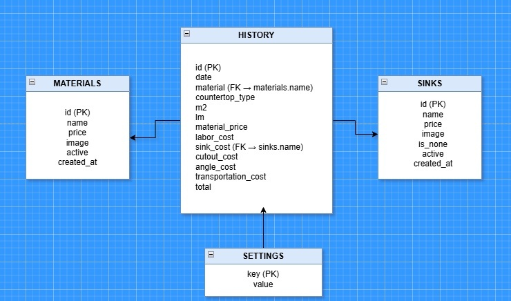
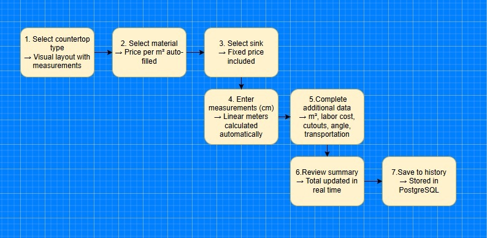
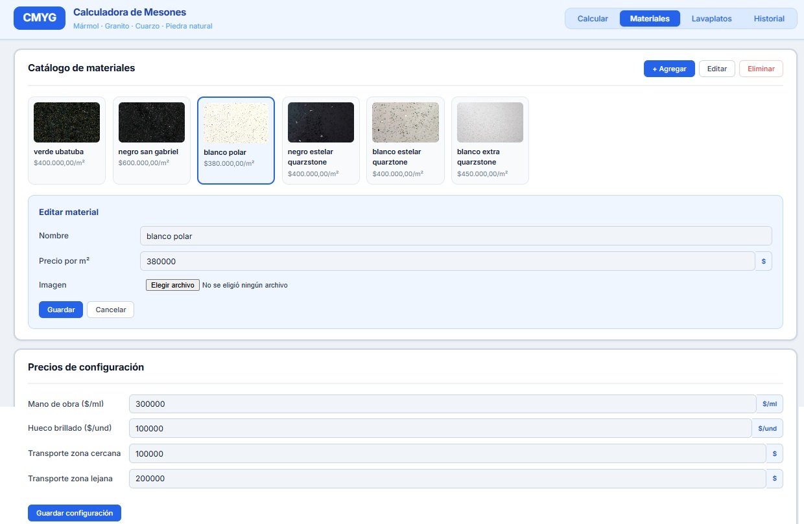
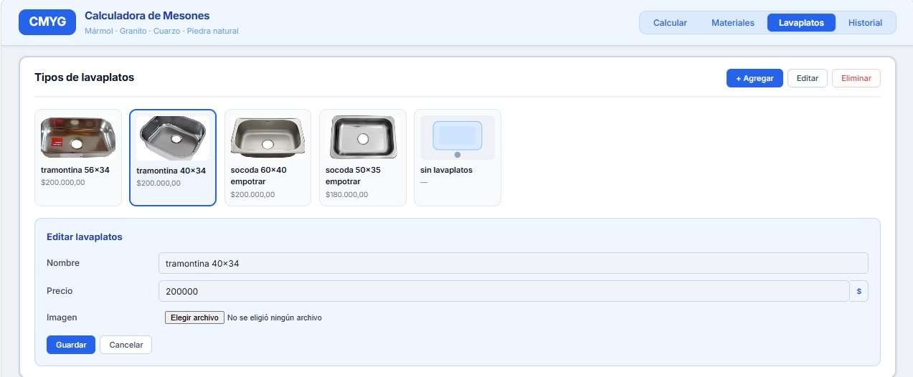
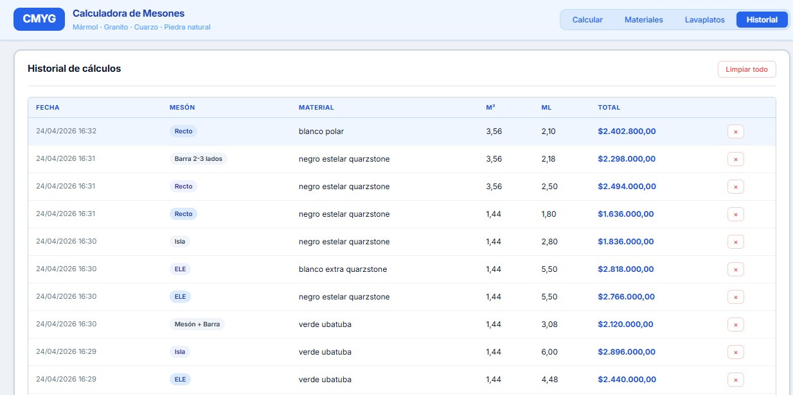
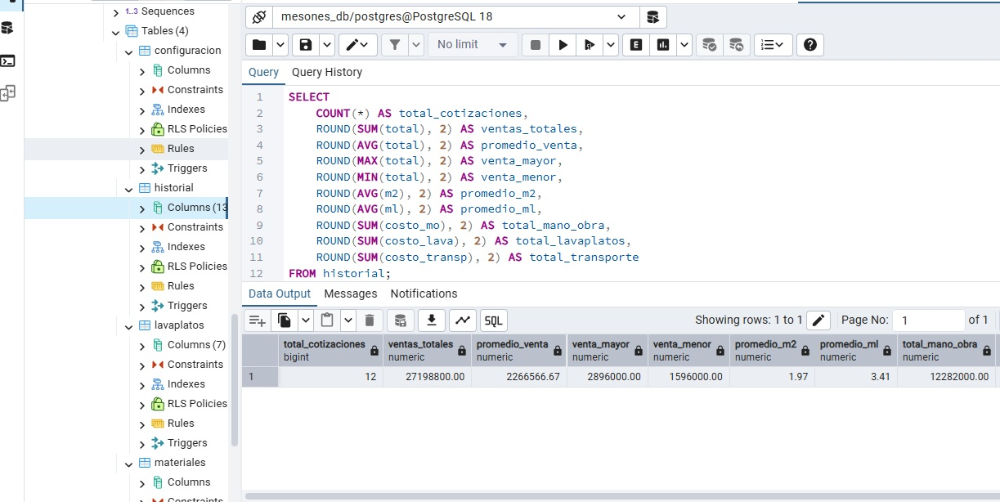
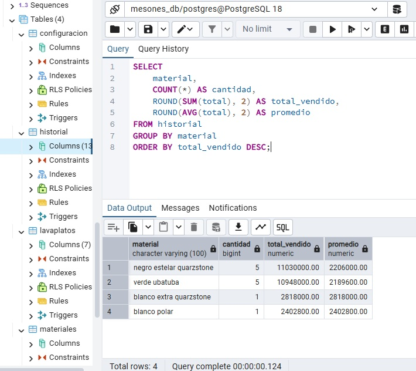
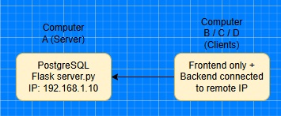

# Countertop Calculator

> Full-stack web application for quoting and calculating natural stone countertops. Client-server architecture with a REST API, PostgreSQL persistence, and a vanilla frontend decoupled from the backend.



[](https://python.org)
[](https://flask.palletsprojects.com)
[](https://postgresql.org)
[](https://developer.mozilla.org/en-US/docs/Web/JavaScript)

---

## Table of contents

- [System architecture](#system-architecture)
- [Technology stack](#technology-stack)
- [Project structure](#project-structure)
- [Database model](#database-model)
- [REST API](#rest-api)
- [Calculation logic](#calculation-logic)
- [Installation and setup](#installation-and-setup)
- [Features](#features)
- [Local network configuration](#local-network-configuration)
- [Security considerations](#security-considerations)

---

## System architecture

The system follows a **three-tier** decoupled architecture communicating over HTTP/JSON:



### Design decisions

| Decision | Alternative considered |
|----------|----------------------|
| Flask over FastAPI | FastAPI |
| PostgreSQL over SQLite | SQLite |
| Vanilla JS over React | React / Vue |
| Soft delete | Hard delete |
| Environment variables (.env) | Hardcoded config |
| Local fallback in frontend | No fallback |

---

## Technology stack

| Layer | Technology | Version | Purpose |
|-------|-----------|---------|---------|
| Frontend | HTML5 / CSS3 | — | Structure and styling |
| Frontend | JavaScript | ES2022 | UI logic and communication |
| Backend | Python | 3.10+ | Server-side logic |
| Backend | Flask | 3.x | HTTP framework / REST API |
| Backend | Flask-CORS | 6.x | Cross-origin access control |
| Backend | psycopg2-binary | 2.9+ | Native PostgreSQL driver |
| Backend | python-dotenv | 1.x | Environment variable management |
| Backend | Werkzeug | 3.x | File handling and secure paths |
| Database | PostgreSQL | 15+ | Relational persistence |
| Typography | Inter (Google Fonts) | — | Modern, readable UI font |

---

## Project structure

```
calculadora_mesones/
│
├── .env.example                # Environment variables template
├── README.md                   # Project documentation
│
├── docs/
│   └── images/                 # Screenshots for the README
│
├── frontend/                   # Presentation layer (user)
│   ├── index.html              # SPA - single entry point
│   ├── assets/
│   │   └── calculator.png      # Application icon
│   ├── css/
│   │   └── styles.css          # Styles with CSS variables (design tokens)
│   └── js/
│       ├── data.js             # Static config: countertop types and ML formulas
│       └── app.js              # Dynamic logic: state, rendering, API calls
│
└── backend/                    # Application and data layer (server)
    ├── servidor.py             # Flask endpoint definitions
    ├── database.py             # Data access layer (DAL)
    ├── .env                    # Environment variables (excluded from git)
    └── uploads/                # User-uploaded images (excluded from git)
```

### Frontend separation of concerns

```
data.js
└── TIPOS_MESON         → Static configuration of geometric shapes and formulas
    ├── campos[]         → Input definitions per countertop type
    ├── formula          → Descriptive formula string
    └── ml()             → Pure function for linear meter calculation

app.js
├── STATE               → Single global state object (single source of truth)
├── apiFetch()          → Fetch abstraction with fallback and timeout
├── render*()           → Pure DOM rendering functions
├── calcular()          → Total price calculation logic
├── initCrud*()         → CRUD event initialization
└── DOMContentLoaded    → Entry point, parallel loading with Promise.all()
```

---

## Database model

```sql

CREATE TABLE materiales (
    id        SERIAL PRIMARY KEY,
    nombre    VARCHAR(100) NOT NULL,
    precio    NUMERIC(10,2) NOT NULL,     
    imagen    TEXT,                        
    activo    BOOLEAN DEFAULT TRUE,        
    creado_en TIMESTAMP DEFAULT NOW()
);

-- Available sink types
CREATE TABLE lavaplatos (
    id         SERIAL PRIMARY KEY,
    nombre     VARCHAR(100) NOT NULL,
    precio     NUMERIC(10,2) NOT NULL,    
    imagen     TEXT,
    es_ninguno BOOLEAN DEFAULT FALSE,     
    activo     BOOLEAN DEFAULT TRUE,     
    creado_en  TIMESTAMP DEFAULT NOW()
);

-- Configurable global prices
CREATE TABLE configuracion (
    clave VARCHAR(50) PRIMARY KEY,       
    valor NUMERIC(10,2) NOT NULL
);

-- Historical quote records
CREATE TABLE historial (
    id           SERIAL PRIMARY KEY,
    fecha        TIMESTAMP DEFAULT NOW(),
    tipo_meson   VARCHAR(50),
    material     VARCHAR(100),
    m2           NUMERIC(10,3),
    ml           NUMERIC(10,3),
    precio_mat   NUMERIC(10,2),
    costo_mo     NUMERIC(10,2),
    costo_lava   NUMERIC(10,2),
    costo_hueco  NUMERIC(10,2),
    costo_angulo NUMERIC(10,2),
    costo_transp NUMERIC(10,2),
    total        NUMERIC(10,2)
);
```

### Entity-relationship diagram



> The history table stores names as strings instead of foreign keys to preserve the historical record even if a material or sink type is later deleted.

---

## REST API

Base URL: `http://localhost:5000`

### Materials

| Method | Endpoint | Description | Body |
|--------|----------|-------------|------|
| GET | `/materiales` | List active materials | — |
| POST | `/materiales` | Create material | `multipart/form-data`: nombre, precio, imagen? |
| PUT | `/materiales/:id` | Update material | `multipart/form-data`: nombre, precio, imagen? |
| DELETE | `/materiales/:id` | Deactivate material (soft delete) | — |

### Sinks

| Method | Endpoint | Description | Body |
|--------|----------|-------------|------|
| GET | `/lavaplatos` | List active sink types | — |
| POST | `/lavaplatos` | Create sink type | `multipart/form-data`: nombre, precio, imagen? |
| PUT | `/lavaplatos/:id` | Update sink type | `multipart/form-data`: nombre, precio, imagen? |
| DELETE | `/lavaplatos/:id` | Deactivate sink type (soft delete) | — |

### Configuration

| Method | Endpoint | Description | Body |
|--------|----------|-------------|------|
| GET | `/config` | Get global prices | — |
| PUT | `/config` | Update global prices | `JSON`: manoObra, precioHueco, transpCerca, transpLejos |

### History

| Method | Endpoint | Description | Body |
|--------|----------|-------------|------|
| GET | `/historial` | List saved calculations | — |
| POST | `/historial` | Save calculation | `JSON`: tipo_meson, material, m2, ml, costs... |
| DELETE | `/historial/:id` | Delete record | — |

### Static files

| Method | Endpoint | Description |
|--------|----------|-------------|
| GET | `/uploads/:filename` | Serve uploaded image |

### Sample response — GET /materiales

```json
[
  {
    "id": 1,
    "nombre": "White Marble",
    "precio": "180.00",
    "imagen": null,
    "activo": true,
    "creado_en": "Wed, 22 Apr 2026 22:19:25 GMT"
  }
]
```
## Installation and setup

### Prerequisites

- Python 3.10+ — [python.org](https://python.org)
- PostgreSQL 15+ — [postgresql.org](https://postgresql.org)
- A database named `mesones_db` created in PostgreSQL

### 1. Clone the repository

```bash
git clone https://github.com/your-username/calculadora_mesones.git
cd calculadora_mesones
```

### 2. Configure environment variables

Copy `.env.example` and rename it as `.env` inside the `backend/` folder:

```env
DB_HOST=localhost
DB_PORT=5432
DB_NAME=mesones_db
DB_USER=postgres
DB_PASSWORD=your_password
```

### 3. Install Python dependencies

```bash
pip install flask flask-cors psycopg2-binary werkzeug python-dotenv
```

### 4. Initialize the database

```bash
python backend/database.py
```

Expected output:

```
[DB] Tables verified successfully.
[DB] Initial materials inserted.
[DB] Initial sinks inserted.
[DB] Initial configuration inserted.
```

### 5. Start the server

```bash
cd backend
python servidor.py
```

Expected output:

```
Starting server at http://localhost:5000
[DB] Tables verified successfully.
 * Running on http://127.0.0.1:5000
```

### 6. Open the application

Open `frontend/index.html` in your browser.

---

## Features

### Calculation flow



### Main calculator


- Visual countertop type selection with dimension diagram
- Automatic linear meter calculation based on type formula
- Material selection with image and price per m²
- Sink selection with image and fixed price
- Total updated in real time using Colombian number format

### Material management



- Full CRUD with optional image upload
- Soft delete — deleted records are not physically removed
- Prices are immediately reflected in the calculator

### Sink management



- Full CRUD identical to material management
- The "No sink" item is protected from deletion

### Quote history



- Persisted in PostgreSQL — survives server restarts
- Individual record deletion
- Full breakdown: m², ML, material, type, total

### Sample SQL queries on mesones_db



General statistics: total quotes, sum, average, highest and lowest sale, average measurements, breakdown by labor, sinks, and transport.



Material ranking: which materials generate the most revenue and have the highest quote volume.

---

## Local network configuration

To share a single database across multiple computers in the team:



### On the server computer (with PostgreSQL)

`backend/.env` unchanged:

```env
DB_HOST=localhost
```

### On client computers

`backend/.env`:

```env
DB_HOST=192.168.1.10
```

`frontend/js/app.js`:

```javascript
const API_URL = 'http://192.168.1.10:5000';
```

To get the server IP on Windows, run `ipconfig` and look for **IPv4 Address**.

---

## Security considerations

- Database credentials are managed exclusively via environment variables (`.env`) — never hardcoded in source code
- The `.env` file is excluded from version control via `.gitignore`
- Flask-CORS is configured to allow access from the local frontend


---

## License

Internal use only. All rights reserved.
